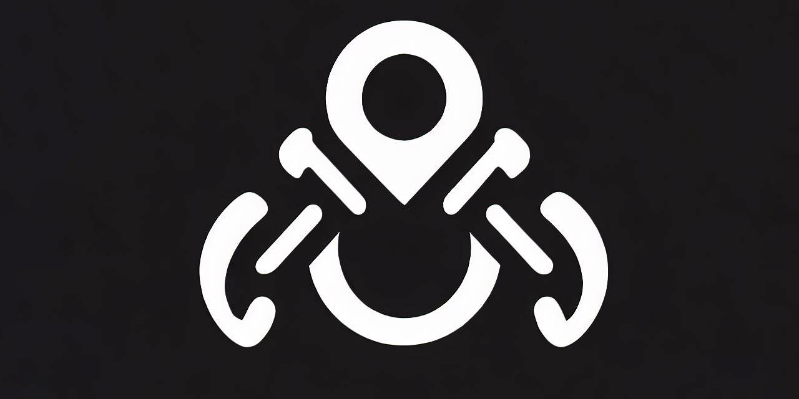
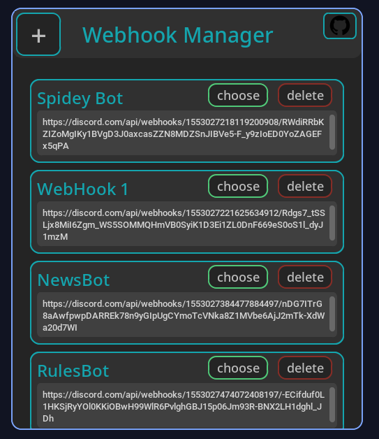
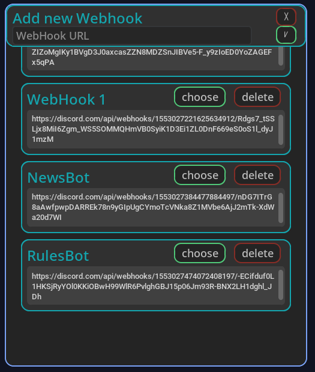
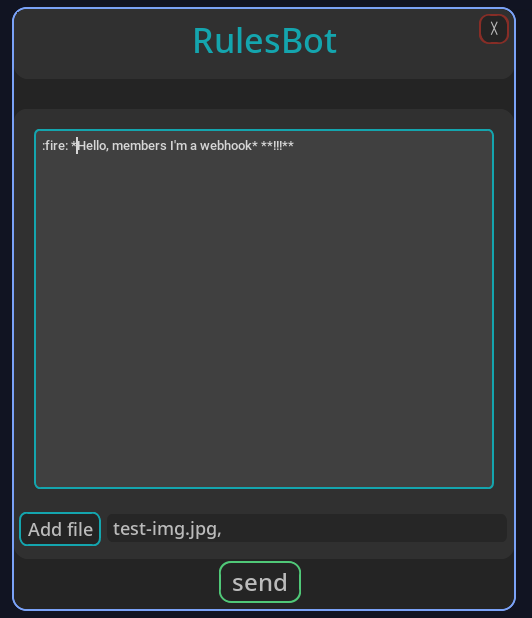
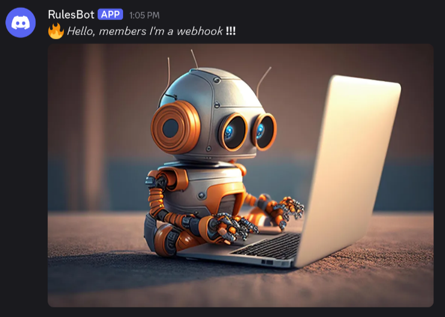

<a id="readme-top"></a>

<p align='center'>
</p>

<h3 align="center">Webhook Manager</h3>

<p align='center'>Comprehensive control panel for managing and controlling all your Discord Webhooks seamlessly</p>

---

<p align='center'>


</p>

<p align='center'>


</p>

---

<h3>Table of Contents</h3>

<ul>
  <li><a href="#overview">Overview</a></li>
  <li><a href="#features">Features</a></li>
  <li><a href="#installation-and-usage">Installation and Usage</a></li>
  <li><a href="#configuration">Configuration</a></li>
  <li><a href="#contributing">Contributing</a></li>
  <li><a href="#known-issues">Known Issues</a></li>
  <li><a href="#troubleshooting">Troubleshooting</a></li>
  <li><a href="#license">License</a></li>
  <li><a href="#contact">Contact</a></li>
  <li><a href="#support-the-project">Support the Project</a></li>
</ul>

---

<h3><a id="overview"></a>Overview</h3>

**Webhook Manager** - a cross-platform, all-in-one control panel for managing your Discord webhooks seamlessly. Built in Python for simplicity, with native Discord API integration.

<h4>The Idea</h4>

Posting from your personal Discord profile in a large, busy server creates inconsistency, your announcements get lost among everyone else's messages. By sending announcements through a dedicated webhook, they appear under a clean, branded name (e.g. "Announcements"), so it's instantly clear to your community what's an official message and who it's from.

<h4>Key features</h4>
<ul>
<li>Cross-platform - runs anywhere Python does</li>
<li>Native Discord API integration</li>
<li>Send messages with custom names, avatars, and embeds</li>
<li>Manage all your webhooks from one place</li>
</ul>

<p align="right">
  <a href="#readme-top" aria-label="Back to top">
    
  </a>
</p>

---

<h3><a id="installation-and-usage"></a>Installation and Usage</h3>

<h4>Installation</h4>

<h5>Retrieve the Code</h5>

In your favorite terminal emulator type:

```
https://github.com/ByteCorum/webhook-manager.git && cd webhook-manager
```

<h5>Install the Dependencies</h5>

On Linux/Mac:

```
python3 -m venv .pyvenv && source ./.pyvenv/bin/activate
python3 -m pip install --upgrade pip && pip3 install -r requirements.txt
```

On Windows:

```
python -m pip install --upgrade pip && pip install -r requirements.txt
```

That's all now u can use it, but if you what to build it to standalone executable, proceed to section below.

<h5>Build Process</h5>

To build the project you need to execute an appropriate building script for your platform.

On Linux/Mac:

```
# Linux
chmod +x ./build-scripts/build-linux.sh && ./build-scripts/build-linux.sh

# Mac
chmod +x ./build-scripts/build-mac.sh && ./build-scripts/build-mac.sh
```

On Windows:

```
./build-scripts/build-win.cmd
```

You will find build executable in project root.

<h4>Usage</h4>

<h4>Main Menu</h4>


<h4>Add New Webhook</h4>


<h4>Compose Message</h4>


<h4>Result in Discord</h4>


<p align="right">
  <a href="#readme-top" aria-label="Back to top">
    
  </a>
</p>

---

<h3><a id="contributing"></a>Contributing</h3>

**Contributions are welcome**: bug reports, feature ideas, documentation improvements, and code.

Before you start:

- Read [CONTRIBUTING.md](docs/CONTRIBUTING.md) it covers the environment setup, branch and commit conventions, pull request expectations, and the AI-generated changes policy
- Check [open issues](https://github.com/ByteCorum/webhook-manager/issues) or start a [discussion](https://github.com/ByteCorum/webhook-manager/discussions) before significant work, to avoid duplicating effort

> [!NOTE]
> By participating in this project, you agree to abide by the [Code of Conduct](docs/CODE_OF_CONDUCT.md).

<p align="right">
  <a href="#readme-top" aria-label="Back to top">
    
  </a>
</p>

---

<h3><a id="known-issues"></a>Known Issues</h3>

Known bugs and planned work are tracked in [TODO.md](docs/TODO.md).
Everything listed there under "Known Issues" is either being fixed
or scheduled to be; anything not listed is unknown, so please
[report it](https://github.com/ByteCorum/webhook-manager/issues/new?labels=type%3A%20bug&template=bug_report.md).

> [!TIP]
> Before concluding something is a bug, check Troubleshooting below, as some behavior, that looks broken not depends on this project.

<p align="right">
  <a href="#readme-top" aria-label="Back to top">
    
  </a>
</p>

---

<h3><a id="troubleshooting"></a>Troubleshooting</h3>

No known quirks to troubleshoot

<!--<h4>Symptom name</h4>

**Cause:** one or two sentences on why this happens.

**Fix:**

1. Configuration steps for the external component, copy-pasteable
2. Verification command or check-->

<p align="right">
  <a href="#readme-top" aria-label="Back to top">
    
  </a>
</p>

---

<h3><a id="license"></a>License</h3>

Distributed under the GPLv3 license.

Copyright (c) 2026 ByteCorum.

<p align="right">
  <a href="#readme-top" aria-label="Back to top">
    
  </a>
</p>

---

<h3><a id="contact"></a>Contact</h3>

<h4>Community</h4>

> [!NOTE]
> Before participating in this community, please read our [Code of Conduct](docs/CODE_OF_CONDUCT.md). By interacting with this repository or community you agree to abide by its terms.

All ways to contact the community or get help are listed in [SUPPORT.md](docs/SUPPORT.md), but short recap provided below.

- **Bug reports, feature requests, documentation issues** should be reported via issues using appropriate forms [here](https://github.com/ByteCorum/webhook-manager/issues/new/choose)
- **Usage questions** are answered in [Discussions](https://github.com/ByteCorum/webhook-manager/discussions/new?category=q-a), not the issue tracker.
- **Security Vulnerabilities** should be reported via Security and quality [tab](https://github.com/ByteCorum/webhook-manager/security/advisories/new)

<h4>Contact the Owner</h4>

Current contact options are listed in the [owner profile](https://github.com/ByteCorum)

> [!IMPORTANT]
> Do not email maintainers directly about support matters, because public questions get public answers, which benefits everyone.

<p align="right">
  <a href="#readme-top" aria-label="Back to top">
    
  </a>
</p>

---

<h3><a id="support-the-project"></a>Support the Project</h3>

If this project is useful to you, consider supporting its development.

All ways to donate are listed in the [author's profile](https://github.com/ByteCorum).

<p align="right">
  <a href="#readme-top" aria-label="Back to top">
    
  </a>
</p>

---


### webhook-manager

🌐The prog for controlling discord webhooks written on python

<p>
  
  
  
  
  
  
  
  
</p>

---

### 🖼Overview

User-friendly interface in the form of a list(it can contain any number of webhooks)


Сonvenient addition of a webhook


Easily use or remove unwanted webhooks


fast work and sending


---

### 🔐Secure

All saved webhooks are stored locally encrypted with 2 keys and 3 ways


---

### 🧱Building

Install required modules `pip install -r requirements.txt`

Run `pack.bat` to pack .py scripts into exe

---

### ❌Builder errors

If you have error like this:


How to solve it read [here](https://www.stechies.com/pip-not-recognized-internal-external-command/)

---
